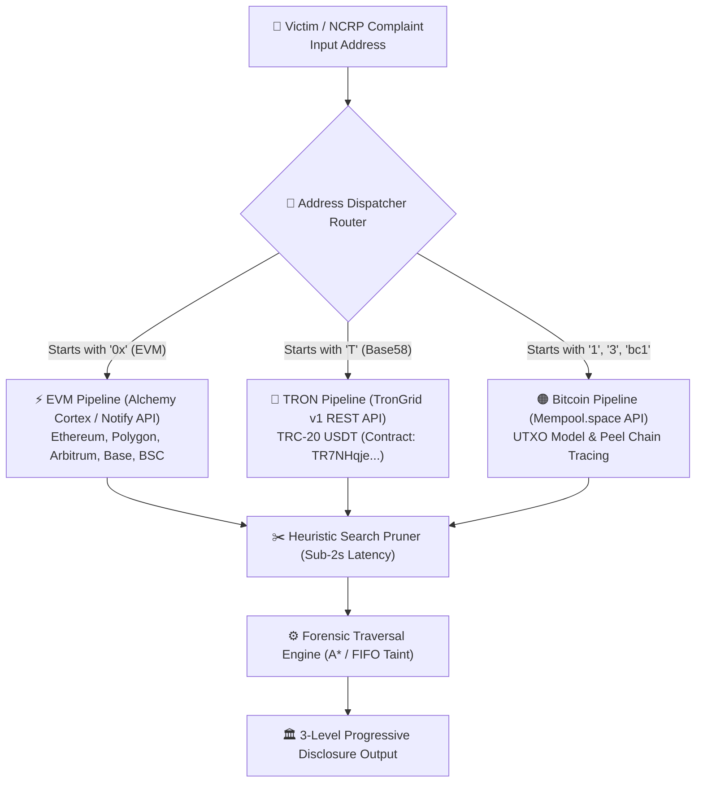
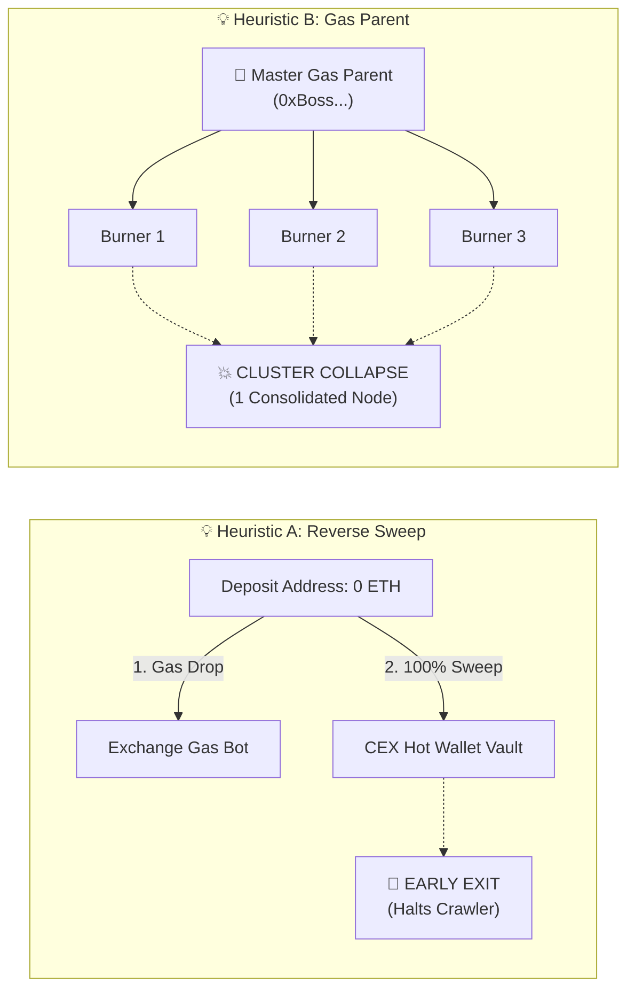
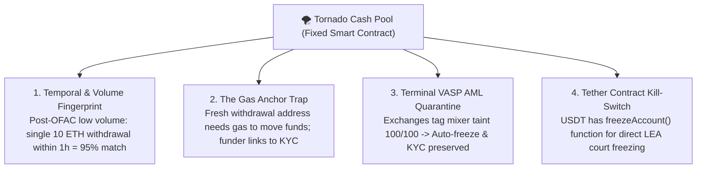
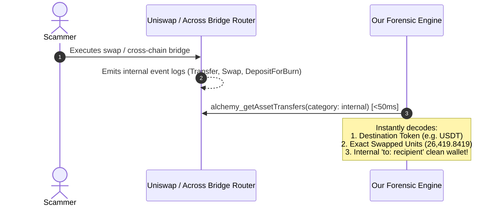
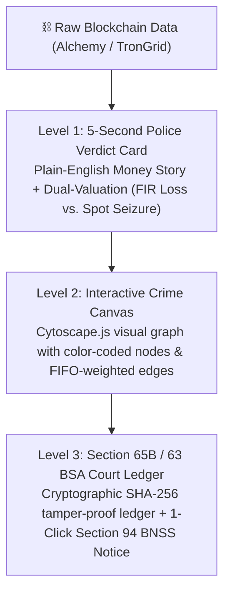

# 🧠 HAFIZ'S FORENSIC DIARY: VISUAL MEMORY CHEAT-SHEET
## SIH 2026 — Crypto Fraud Attribution System (Quick Revision & Jury Defense Guide)

---

## 🗺️ 1. Big Picture: Multi-Chain Ingestion Router



### 📌 3 Core Ingestion Rules:
* **The 80% Reality**: Over 70–80% of Indian cyber fraud (task scams, courier scams) runs on **TRON (TRC-20 USDT)** because fees are pennies (₹8–₹10) and settlement takes 3 seconds.
* **The Alchemy Rule**: Alchemy is top-tier for EVM (sub-second webhooks, internal traces), but **does NOT support TRON**.
* **The Zero-Cost Multi-Chain Fix**: We **augment**, never replace. EVM via Alchemy, TRON via TronGrid (`GET /v1/accounts/{addr}/transactions/trc20`), Bitcoin via Mempool.space. Total external license cost = **₹0**.

---

## 💡 2. The 5 Indelible Mental Models & Analogies

```
+-----------------------------------------------------------------------------------------------+
| 1. THE CAR FUEL ANALOGY (Token vs. Native Gas)                                                |
|    - Car = Wallet                                                                             |
|    - Gold in Trunk = USDT (Smart contract spreadsheet entry)                                  |
|    - Petrol in Tank = ETH / TRX / BNB (Native gas needed to execute transfer)                |
|    >> RULE: 0 ETH = Completely Paralyzed. Scammer CANNOT move USDT without buying gas!        |
+-----------------------------------------------------------------------------------------------+
| 2. THE GAS ANCHOR / UMBILICAL CORD (The Fatal OpSec Mistake)                                  |
|    - Scammer receives USDT into empty burner wallet.                                          |
|    - Scammer MUST inject a tiny amount of ETH (e.g. 0.005 ETH) from outside to move it.       |
|    >> FORENSIC TRAP: Tracing that gas funder links back to their KYC Exchange or Master Hub! |
+-----------------------------------------------------------------------------------------------+
| 3. SECURITY GUARD VS. DETECTIVE (The Silent Freeze Crisis)                                    |
|    - Exchange (Binance/CoinDCX) = Security guard who locked a suspicious person in a room.    |
|    - Our System = Detective who walks in with FIR, proves ownership, and recovers the money.  |
|    >> WITHOUT US: Money stays frozen as "Zombie Assets" forever (Exchange won't call police). |
+-----------------------------------------------------------------------------------------------+
| 4. SHARED COAT-ROOM PRINCIPLE (Tornado Cash De-Anonymization)                                 |
|    - Mixers CANNOT create random addresses; everyone deposits into identical fixed pools:     |
|      [0.1 ETH] | [1.0 ETH] | [10.0 ETH] | [100.0 ETH]                                         |
|    - Post-OFAC volume dropped 90% -> Narrow temporal window + amount match = >90% correlation.|
+-----------------------------------------------------------------------------------------------+
| 5. EVM VS. TRON LAUNDERING TOPOLOGY                                                           |
|    - EVM: High fees -> Scammers use Smart Contract Mixers (Tornado Cash).                     |
|    - TRON: Pennies fees -> Scammers use High-Velocity Peel Chains (50 burners in 60 seconds). |
+-----------------------------------------------------------------------------------------------+
```

---

## ⚡ 3. Kunal's 4 Breakthrough Heuristics



### Quick Reference Matrix:

| Heuristic | The Problem It Solves | The On-Chain Mechanism | Search Optimization Impact |
| :--- | :--- | :--- | :--- |
| **A. Reverse Sweep** | Unlabelled dynamic deposit addresses look like ordinary users | Inbound gas from CEX dispatcher + 100% balance wiped out into known hot wallet | **Early Exit Terminal Condition**: Halts crawl, avoids exchange omnibus black hole |
| **B. Gas Parent** | Scammers split funds across 10–20 burners to confuse police | Query genesis inbound tx (`order: asc, limit: 1`); same funder created all burners | **Cluster Collapse**: Merges 20 branches into 1 Syndicate Node (shrinks tree by 90%) |
| **C. Golden Hour** | Deep historical scanning wastes time & RPC compute units | Restrict block search (`fromBlock: victim_block`); countdown timer for recovery | **Temporal Bounding**: 0–2h recovery is >90%; reduces 100,000 paths to <10 paths |
| **D. 4 AI Detectives** | Black-box loading spinners confuse police officers | 4 streaming personas: 🕵️ Hunter, 🔍 Profiler, 🏛️ Legal Officer, 🏢 Exchange Officer | **Operational Transparency**: Masks RPC latency & presents court-ready narrative |

---

## 🛡️ 4. The 4-Pillar Mixer Evasion Breaker (Tornado Cash)



### The 4 Primary Fixed Ethereum Mixer Pools:
1. `0x12D66f87A04A9E220743712CE6d9bB1B5616B8Fc` — **0.1 ETH Pool**
2. `0x47CE0C6eD5B0Ce3d3A51fdb1C52DC66a7c3c2936` — **1.0 ETH Pool**
3. `0x910Cbd523D972eb0a6f4cAe4618aD62622b39DbF` — **10.0 ETH Pool**
4. `0xA160cdAB225685dA1d56aa342Ad8841c3b53f291` — **100.0 ETH Pool**

---

## 🌉 5. Bridge & DEX Swaps: Zero-Search Architecture



* **The Myth**: You must scan thousands of DEX liquidity pools coin-by-coin.
* **The Reality**: The smart contract receipt is **100% deterministic**. One internal transaction call decodes the exact output token, units, and hidden destination address.
* **When is Heuristic H5 (Fractional Matching) used?** Only for **Batch Auctions (CoW Swap)** and **Disjoint Non-EVM Chains (Thorchain / Native Bitcoin)**.

---

## ⚖️ 6. Taint Propagation Models: Court vs. UI

```
┌─────────────────────────────────────────────────────────────────────────────┐
│                       TAINT ACCOUNTING DUAL-MODEL                           │
├──────────────────────────────────────┬──────────────────────────────────────┤
│ 📜 FIFO (First-In, First-Out)        │ 🎨 HAIRCUT (Pro-Rata Percentage)     │
│ ------------------------------------ │ ------------------------------------ │
│ - Master Court Ledger Model          │ - Crime Canvas Visual Risk Meter     │
│ - Earliest coins arriving leave 1st  │ - Every output carries % taint ratio │
│ - Accepted under Section 65B/63 BSA  │ - Intuitive color gradient on UI     │
│ - Traditional bank accounting standard│ - Prevents visual information overload│
├──────────────────────────────────────┴──────────────────────────────────────┤
│ 🚫 POISON MODEL: STRICTLY BANNED (prevents falsely freezing innocent people)│
└─────────────────────────────────────────────────────────────────────────────┘
```

---

## 🏛️ 7. 3-Level Progressive Disclosure Legal Framework



### Dual Valuation Model:
1. **Historical Incident Valuation**: Token price at block timestamp of the fraud $\rightarrow$ Fixes FIR Crime Loss under IPC / BNS.
2. **Real-Time Spot Valuation**: Current market price via Alchemy Prices API $\rightarrow$ Court Attachment & Freeze Warrant under Section 94 BNSS.

---

## 🎯 8. Master Jury Defense Cheat-Sheet (Fast Recall Matrix)

| # | Jury Trap / Question | 1-Sentence Champion Rebuttal |
| :-: | :--- | :--- |
| **Q1** | *Why use Alchemy if 80% of Indian scams use TRON?* | We use a **hybrid decoupled architecture**: Alchemy powers EVM with enterprise webhooks, while a dedicated **TronGrid v1 worker** parses TRC-20 USDT at zero API cost. |
| **Q2** | *Alchemy doesn't know address owners. How do you find Binance?* | RPCs give raw data; our proprietary **Reverse Sweep Heuristic** detects CEX gas provisioning and 100% wallet drainage into known VASP hot vaults. |
| **Q3** | *Why not just buy Chainalysis or TRM Labs?* | Foreign tools cause **data sovereignty issues** under DPDP, cost **₹1.5 Crore/yr**, and have **zero integration** with India's 1930 Helpline, NCRP, or Section 63 BSA evidence standards. |
| **Q4** | *What if Alchemy gets rate-limited during a live case?* | We use **weighted round-robin RPC failover** (Alchemy $\rightarrow$ QuickNode $\rightarrow$ LlamaNodes) backed by local PostgreSQL/Neo4j subgraph caching. |
| **Q5** | *How do you handle 10-hop peel chains without crashing?* | Our engine detects asymmetric 1-in-2-out transactions (>80% change vs <20% hop) and **collapses the entire peel chain into a single edge in <2 seconds**. |
| **Q6** | *Doesn't BFS graph search explode exponentially ($10^N$)?* | We prune the tree via **Reverse Sweep early exit**, **Gas Parent cluster collapse**, and **Golden Hour temporal bounding**, reducing 100,000 paths to <10. |
| **Q7** | *How to prove 15 burner wallets belong to the same scammer?* | In EVM, wallets need native gas to move tokens; our **Gas Parent Heuristic** proves that all 15 burners were activated by the same genesis funding wallet. |
| **Q8** | *What if the scammer routes stolen crypto into Tornado Cash?* | We defeat mixers using **4 pillars**: temporal/volume correlation, gas anchor unmasking, terminal VASP AML quarantining, and Tether's on-chain `freezeAccount()`. |
| **Q9** | *If Binance already freezes Tornado Cash deposits, why need us?* | Binance's freeze is **silent and internal**; without our Section 65B/63 BSA dossier and Section 94 BNSS notice, the funds sit forever as unrecoverable **"Zombie Money"**. |
| **Q10**| *How do you trace dormant wallets sleeping for months?* | Dormant wallets are unmasked by their **Gas Umbilical Cord** and tracked 24/7 with zero polling cost using **Alchemy Notify persistent webhooks**. |

---

## 📊 9. Visual Forensic Flow: The Complete Journey of a Stolen Token

```
[VICTIM'S WALLET]
       │
       ▼ (1. Transfer 50,000 USDT)
[BURNER WALLET #1] ◄────── [GAS ANCHOR: 0.005 ETH from KYC Exchange]
       │
       ▼ (2. High-Speed Peel Chain: Splits into 3 burners)
┌──────┴──────────────────────────┐
▼                                 ▼
[BURNER WALLET #2]         [BURNER WALLET #3]
│                                 │
│ (All activated by same          │
│  Gas Parent: 0xBoss...)         │
▼                                 ▼
[COLLAPSED SYNDICATE CLUSTER: 0xBoss...]
       │
       ▼ (3. Consolidation into Unlabelled Deposit Box)
[CEX DEPOSIT ADDRESS]
       │  ▲
       │  │ (Gas Injection: 0.002 ETH from Binance Gas Bot)
       │  │
       ▼  │ (100% Depletion: All 50,000 USDT swept)
[BINANCE HOT WALLET 14 (0x28c6c...)] ──► [🛑 EARLY EXIT TRIGGERED]
       │
       ▼ (4. Automated Evidence Compilation)
┌─────────────────────────────────────────────────────────────┐
│ 1. Level 1 Verdict Card: Binance Hot Wallet 14 Identified    │
│ 2. Level 2 Crime Canvas: Visual Cytoscape cluster mapped    │
│ 3. Level 3 Court Ledger: SHA-256 Cryptographic Hash locked  │
│ 4. Statutory Action: Section 94 BNSS Notice to Binance Legal │
└─────────────────────────────────────────────────────────────┘
```
